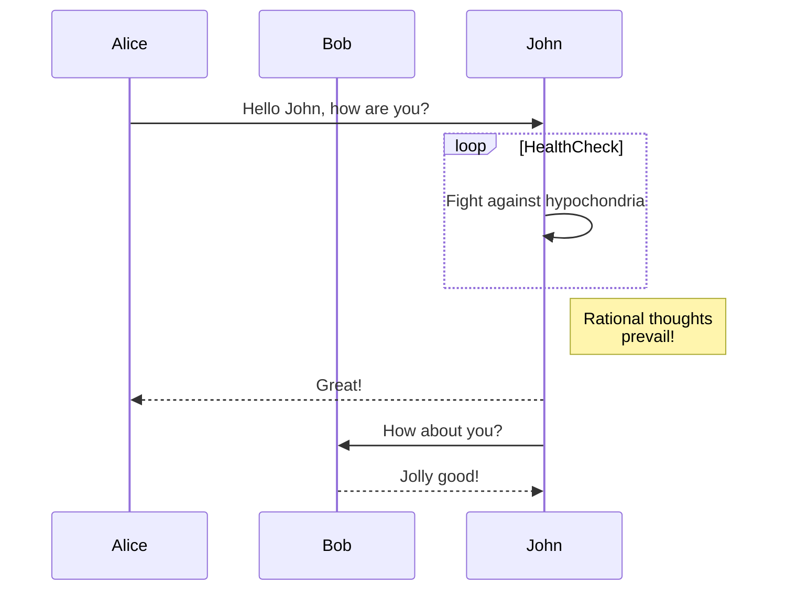

# {title}

This page is here so you can see how sub-folders and Mermaid diagrams work.

## Diagrams

Here's a diagram:
<div style="background: #222; border-radius: 1em;" class="margin-vert--md padding--lg">


</div>

It was generated using `mermaid` as the language in a code fence. Example:

````markdown
  ```mermaid
  sequenceDiagram
  participant Alice
  participant Bob
  Alice->>John: Hello John, how are you?
  loop HealthCheck
    John->>John: Fight against hypochondria
  end
  Note right of John: Rational thoughts <br/>prevail!
  John-->>Alice: Great!
  John->>Bob: How about you?
  Bob-->>John: Jolly good!
  ```
````

## See Also

**See also: [How the docs system works](/docs/docs-system/).**